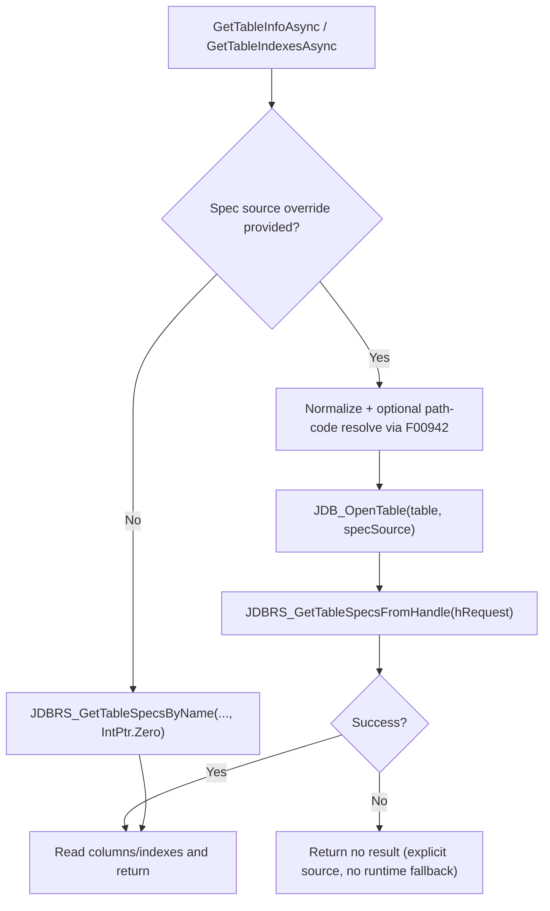
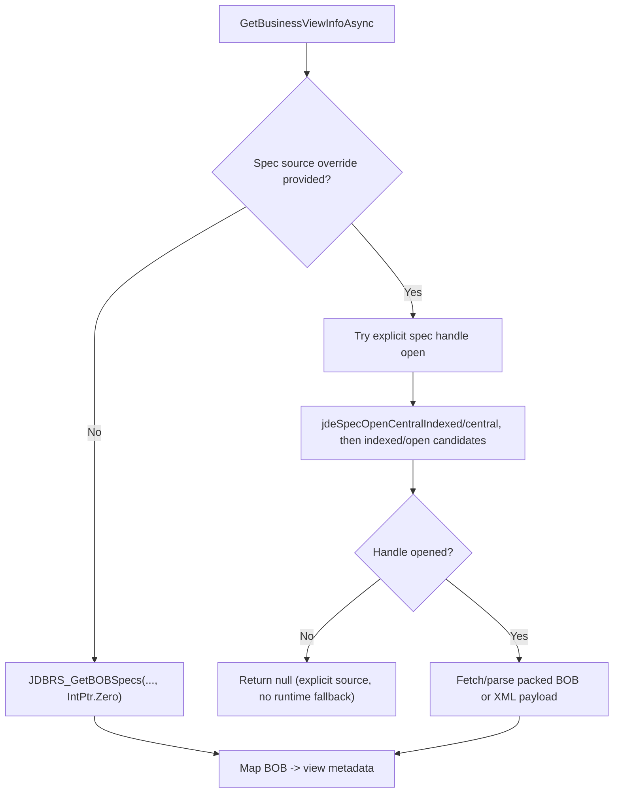
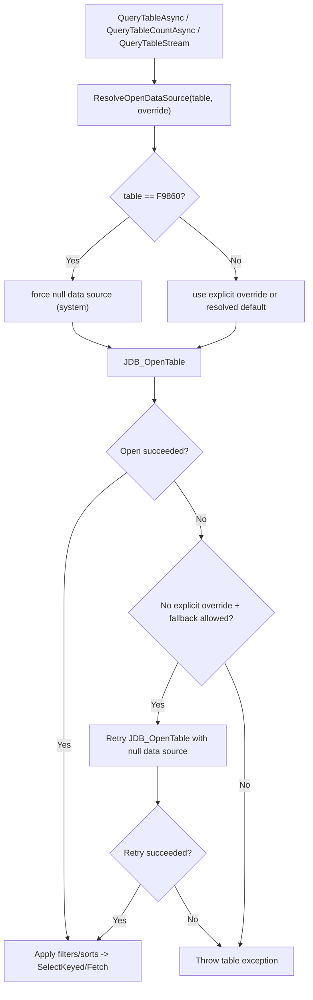
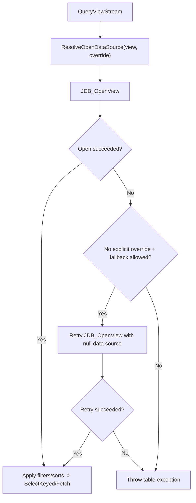

# JDE C API Workflows (JdeClient.Core)

This document maps `JdeClient.Core` features to underlying JDE C APIs used
through `jdekrnl.dll` (and related DLLs). Use it to debug path code/data source
behavior and to validate override/fallback rules.

## High-Level Map

| Workflow | Primary APIs | Notes |
| --- | --- | --- |
| Session bootstrap | `JDB_GetEnv`, `JDB_GetLocalClientEnv`, `JDB_InitEnv`, `JDB_InitUser` | Runs on the JdeSession worker thread. Handles are freed with `JDB_FreeUser` / `JDB_FreeEnv`. |
| Object catalog (F9860) | `JDB_OpenTable`, `JDB_SetSelection`, `JDB_SelectKeyed`, `JDB_Fetch`, `JDB_GetTableColValue` | `F9860` override is ignored; runtime-default/system context is used. |
| Table queries | `JDB_OpenTable`, `JDB_SetSelectionX`, `JDB_SelectKeyed`, `JDB_Fetch` | Query APIs open with resolved data source. Retry with `null` is only attempted when no explicit override is supplied. |
| View queries | `JDB_OpenView`, `JDB_SetSelectionX`, `JDB_SelectKeyed`, `JDB_Fetch` | Same fallback rule as table queries (no explicit override -> optional retry). |
| Table row count | `JDB_SelectKeyedGetCount` | Selection is applied first; no row data is fetched. |
| Table specs (default) | `JDBRS_GetTableSpecsByName`, `JDBRS_FreeTableSpecs` | Used when no explicit spec source is provided. |
| Table specs (explicit source) | `JDB_OpenTable`, `JDBRS_GetTableSpecsFromHandle`, `JDB_CloseTable` | Used when `objectLibrarianDataSourceOverride` is provided. No runtime-default fallback when explicit source fails. |
| Business view specs (default) | `JDBRS_GetBOBSpecs`, `JDBRS_FreeBOBSpecs` | Used when no explicit spec source is provided. |
| Business view specs (explicit source) | `jdeSpecOpenCentralIndexed`, `jdeSpecOpenCentral`, `jdeSpecOpenIndexed`, `jdeSpecOpen`, `jdeSpecFetchSingle`, `jdeSpecSelectKeyed`, `jdeSpecFetch`, `jdeSpecConvertToXML_UTF16` | Used when `objectLibrarianDataSourceOverride` is provided. No runtime-default fallback when explicit source fails. |
| Path code discovery | `JDB_OpenTable`/query path for `F00942` | `GetAvailablePathCodesAsync` ignores caller override and uses system context for `F00942`. |
| Data source discovery | `JDB_OpenTable`/query path for `F98611` | `GetAvailableDataSourcesAsync` ignores caller override and uses system context for `F98611` candidates. |
| Event rules tree (BSFN) | `JDB_OpenTable`, `JDB_SelectKeyed`, `JDB_Fetch` | Reads `F9862` to map function name -> EVSK + DSTMPL. |
| Event rules tree (APPL/UBE/TBLE) | `JDB_OpenTable`, `JDB_SetSelectionX`, `JDB_SelectKeyed`, `JDB_Fetch` | Reads `F98740` (GBRLINK). |
| Event rules XML | `jdeSpecOpen*`, `jdeSpecSelectKeyed`, `jdeSpecFetch`, `jdeSpecInitXMLConvertHandle`, `jdeSpecConvertToXML_UTF16`, `jdeSpecFreeData` | Reads `F98741` (GBRSPEC). |
| Data structure XML | `jdeSpecOpen*`, `jdeSpecFetchSingle`, `jdeSpecSelectKeyed`, `jdeSpecFetch`, `jdeSpecInitXMLConvertHandle` | Reads `F98743` (DSTMPL). |
| Project metadata | `JDB_OpenTable`, `JDB_SetSelectionX`, `JDB_SelectKeyed`, `JDB_Fetch` | `F98220`/`F98221`/`F98222`. Path code is optional and often legacy. |
| Spec repositories (zip) | `jdeSpecOpenRepository`, `jdeSpecOpenFile`, `jdeSpecCloseRepository` | Used when reading spec ZIP repositories (for example, manifest). |
| OMW export | `OMWCallSaveObjectToRepositoryEx` (`jdeomw.dll`) | Wired to `JdeClient.ExportProjectToParAsync` with optional external save location (parameter 7096). |

## Notes by Workflow

### Path Code vs Data Source

- Path code chooses a spec lineage (for example `PY920`, `PD920`, `LOCAL`).
- Data source chooses runtime table/view data location (for example `TESTDTA`, `CRPDTA`).
- They are related but not equivalent.

For table specs:

- Path code tokens are resolved through `F00942` (`EMPATHCD` -> `EMDATS`/`DATS`).
- Resolved source is then used with `JDB_OpenTable` + `JDBRS_GetTableSpecsFromHandle`.

For business view specs:

- Explicit source tokens are passed to spec-open APIs directly.
- Path-code style values are attempted with central open APIs first.

### System Tables and Overrides

`F9860`, `F98611`, and `F00942` are treated as system tables in current code paths:

- `F9860` ignores data source override and opens in runtime-default/system context.
- `GetAvailablePathCodesAsync` ignores caller override for `F00942`.
- `GetAvailableDataSourcesAsync` ignores caller override for `F98611`.

### Fallback Rules

- Query APIs (`QueryTable*`, `QueryViewStream`) only retry open with `null` when:
  - no explicit data source override was provided, and
  - a resolved default data source was used first.
- Table/business view spec APIs do not runtime-fallback when explicit spec source is provided and fails.
- Event-rules/business-function explicit location calls are strict (no location fallback).

## Mermaid Diagrams

### Table Spec Call Chain

### Business View Spec Call Chain

### Table Query Call Chain

### View Query Call Chain

